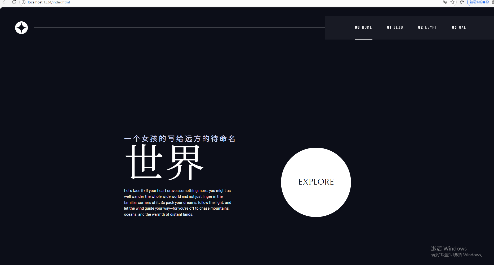
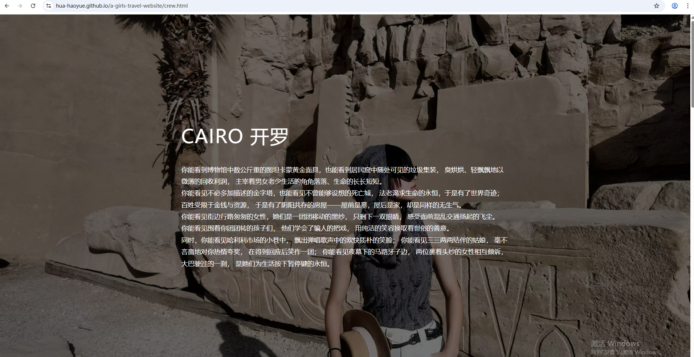
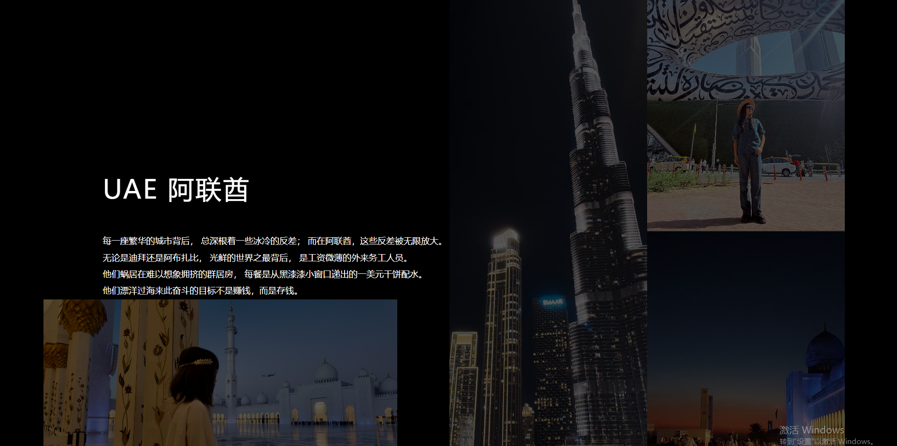
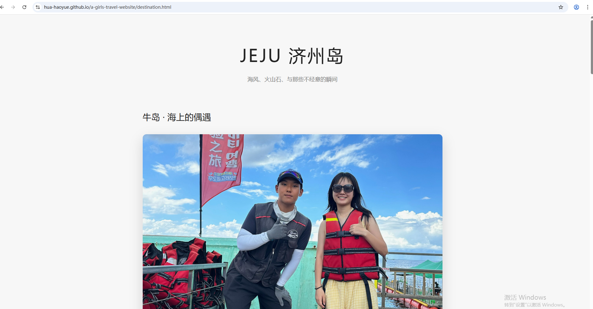

The universe is vast.

But sometimes,
a small travel website
is enough to hold a world.


# 🌏 A Girl’s Travel Website

> “The world is large,
> and I am still learning how to walk through it.”

This is a small travel website built by a **freshman learning web development by herself**.

Originally inspired by a space-exploration template,
this project transforms the idea of *exploring planets* into something closer to real life:

**exploring the Earth.**

Instead of galaxies and spacecrafts,
this website tells stories about places, people, and fleeting moments during travels.

It is both:

* a **front-end learning project**
* and a **digital travel journal**

📍 **Live Website**

👉 https://hua-haoyue.github.io/a-girls-travel-website/





---

# ✨ The Idea

Photos fade in phone albums.
Memories blur over time.

So I thought:

> What if travel memories could live on the internet?

This website is my attempt to turn travel into something **interactive and lasting**.

Each page is written more like a **short narrative** than a traditional travel guide.

Because what I want to record is not just **where I went**,
but **what the world felt like in those moments**.

---

# 🗺 Pages

### 🌍 Home

The entrance of the website.

A girl writing to a world she has not fully seen yet.

---

### 🇪🇬 Egypt

Ancient pyramids and modern chaos.
Golden masks in museums, and garbage collectors in narrow streets.

A place where **history and reality collide every day**.

---

### 🇰🇷 Jeju

Quiet memories by the sea.

* dolphins appearing beside a yacht near Udo Island
* a small restaurant whose pork bone soup we never found again
* early morning sea women diving into cold water

A page about **small moments that stay in memory**.

---

### 🇦🇪 UAE

A story about contrast.

Skyscrapers, luxury cars, and blue coastlines
standing beside migrant workers and invisible lives.

Two groups of children growing up under the same sky —
yet living completely different worlds.

---

# 🛠 Tech Stack

This project is built using:

* **HTML5**
* **SCSS**
* **Vanilla JavaScript**
* **Parcel Bundler**
* **GitHub Pages**

The project structure was initially inspired by a space tourism template,
but the travel pages and narrative design were rewritten and redesigned.

---

# 📂 Project Structure

```
src
│
├── assets
│   ├── crew        (Egypt images)
│   ├── destination (Jeju images)
│   ├── technology  (UAE images)
│
├── pages
│   ├── crew.html
│   ├── destination.html
│   └── technology.html
│
├── scripts
│   ├── nav.js
│   ├── btn.js
│   └── tabs.js
│
└── scss
    └── index.scss
```

---

# 🚀 Run Locally

Clone the repository

```
git clone https://github.com/hua-haoyue/a-girls-travel-website.git
```

Install dependencies

```
npm install
```

Run development server

```
npm run dev
```

Open

```
http://localhost:1234
```

---

# 🌱 Why I Put This on GitHub

I'm a freshman still learning programming.

But I believe GitHub is not only for big projects or professional code.

It can also be a place to share:

* ideas
* stories
* experiments
* and pieces of life.

If someone else also wants to build their own **travel journal website**,
feel free to use this project as inspiration.

---

# 💫 A Small Dream

Maybe one day this repository will have more pages.

More cities.
More stories.
More versions of the world.

Until then,

this is just a small website
built by a girl who wants to see the world.
